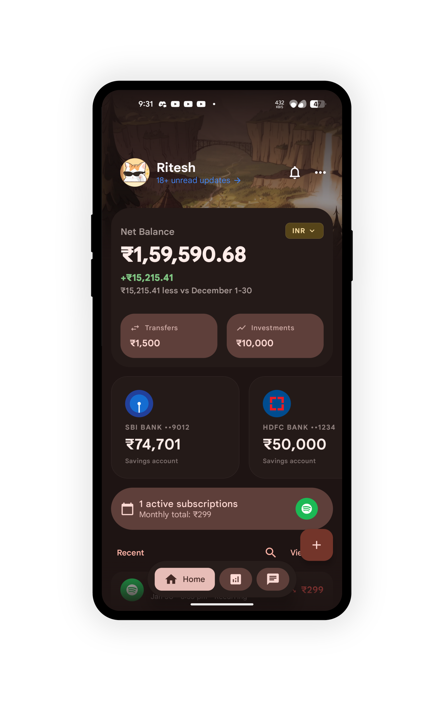
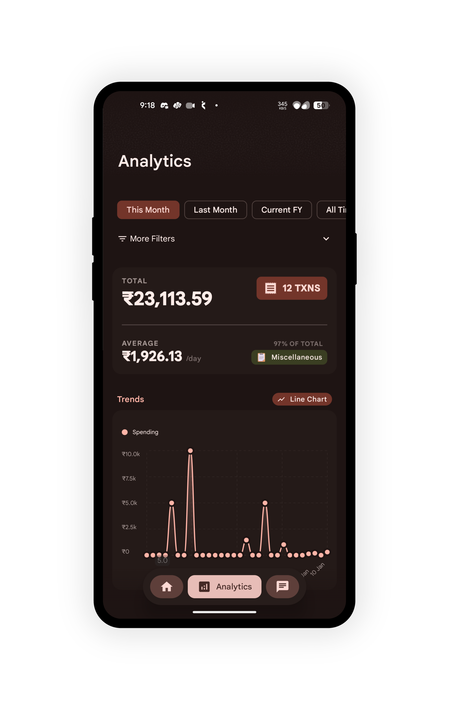
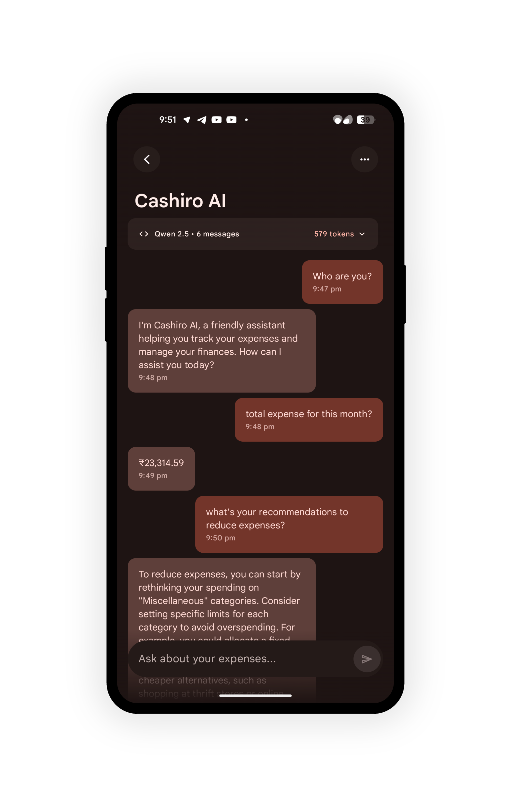
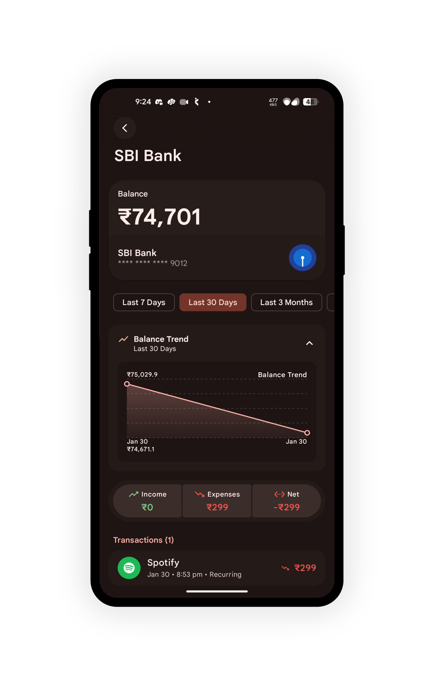
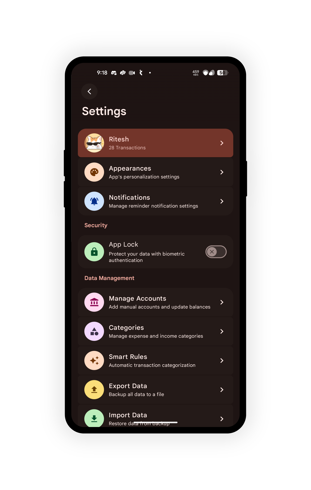

<a name="top"></a>
[](https://github.com/sarim2000/pennywiseai-tracker)
[](https://github.com/sarim2000/pennywiseai-tracker)
[](LICENSE)
[](https://developer.android.com/about/versions/12)
[](https://kotlinlang.org/)
[](https://developers.google.com/mediapipe)
[](https://play.google.com/store/apps/details?id=com.pennywiseai.tracker)

[//]: # ([![F-Droid]&#40;https://img.shields.io/f-droid/v/com.pennywiseai.tracker?color=1976d2&#41;]&#40;https://f-droid.org/packages/com.pennywiseai.tracker/&#41;)
[//]: # ([![GitHub release]&#40;https://img.shields.io/github/v/release/sarim2000/pennywiseai-tracker&#41;]&#40;https://github.com/sarim2000/pennywiseai-tracker/releases&#41;)

[//]: # ([![GitHub last commit]&#40;https://img.shields.io/github/last-commit/sarim2000/pennywiseai-tracker&#41;]&#40;https://github.com/sarim2000/pennywiseai-tracker/commits&#41;)

[//]: # ([![Discord]&#40;https://img.shields.io/badge/Discord-Join_Community-5865F2&#41;]&#40;https://discord.gg/H3xWeMWjKQ&#41;)

## Cashiro — Free & Open‑Source, private SMS‑powered expense tracker

A Fork of [PennyWise AI](https://github.com/sarim2000/pennywiseai-tracker) that Turn bank SMS into a clean, searchable money timeline with on-device AI assistance. 100% private, no cloud processing.


[//]: # ()
[//]: # (⭐ **Star us on GitHub — join 100+ supporters!**)

[//]: # ()
[//]: # ([![Share]&#40;https://img.shields.io/badge/share-000000?logo=x&logoColor=white&#41;]&#40;https://x.com/intent/tweet?text=Check%20out%20PennyWise%20AI%20-%20Privacy-first%20expense%20tracker%20with%20on-device%20AI:%20https://github.com/sarim2000/pennywiseai-tracker%20%23Android%20%23PrivacyFirst%20%23OnDeviceAI&#41;)

[//]: # ([![Share]&#40;https://img.shields.io/badge/share-0A66C2?logo=linkedin&logoColor=white&#41;]&#40;https://www.linkedin.com/sharing/share-offsite/?url=https://github.com/sarim2000/pennywiseai-tracker&#41;)

[//]: # ([![Share]&#40;https://img.shields.io/badge/share-FF4500?logo=reddit&logoColor=white&#41;]&#40;https://www.reddit.com/submit?title=PennyWise%20AI%20-%20Privacy-first%20expense%20tracker&url=https://github.com/sarim2000/pennywiseai-tracker&#41;)

[//]: # ([![Share]&#40;https://img.shields.io/badge/share-0088CC?logo=telegram&logoColor=white&#41;]&#40;https://t.me/share/url?url=https://github.com/sarim2000/pennywiseai-tracker&text=Check%20out%20PennyWise%20AI&#41;)

## Overview

For Android users worldwide who want automatic expense tracking from bank SMS — clean categories, subscription detection, and clear insights. Supporting 40+ banks across 5 countries with multi-currency capabilities.

[//]: # (<a href="https://play.google.com/store/apps/details?id=com.pennywiseai.tracker">)

[//]: # (  )

[//]: # (</a>)

[//]: # (<a href="https://f-droid.org/packages/com.pennywiseai.tracker">)

[//]: # (  )

[//]: # (</a>)

### How it works

1. Grant SMS permission (read‑only). No inbox changes, no messages sent.
2. Cashiro parses transaction SMS, extracts amount, merchant, category, and date.
3. View analytics, subscriptions, and the full transaction timeline — with on-device AI assistant for insights.

## Why Cashiro

- **🤖 Smart SMS Parsing** - Automatically extracts transaction details from 40+ banks across 5 countries
- **🌍 Multi-Currency Support** - Native support for ₹, $, د.إ, ₨, ብር with proper localization
- **📊 Clear Insights** - Analytics and charts to instantly see where money goes
- **🔄 Subscription Tracking** - Detects and monitors recurring payments
- **💬 On-device AI Assistant** - Ask questions like "What did I spend on food last month?" locally
- **🏷️ Auto‑Categorization** - Clean merchant names and sensible categories and subcategories
- **📤 Data Export** - Export as CSV or PDF for taxes or records

## Supported Banks & Countries

Supporting **47+ banks** across **10 countries** with **multi-currency** capabilities:

### 🇮🇳 India (35 banks) - INR ₹
- **HDFC Bank**, **State Bank of India (SBI)**, **ICICI Bank**
- **Axis Bank**, **Punjab National Bank (PNB)**, **IDBI Bank**
- **Indian Bank**, **Federal Bank**, **Karnataka Bank**, **Kerala Gramin Bank**
- **Canara Bank**, **Bank of Baroda**, **Bank of India**
- **Jupiter (CSB Bank)**, **Amazon Pay (Juspay)**, **Kotak Bank**
- **IDFC First Bank**, **Union Bank**, **HSBC Bank**
- **Central Bank of India**, **South Indian Bank**, **JK Bank**
- **Indian Overseas Bank**, **Airtel Payments Bank**, **AMEX**
- **OneCard**, **UCO Bank**, **AU Bank**, and more...

### 🇺🇸 USA (4 banks) - USD $
- **Citi Bank**, **Discover Card**, **Old Hickory Credit Union**, **Charles Schwab**

### 🇦🇪 UAE (3 banks) - AED د.إ
- **First Abu Dhabi Bank (FAB)**
- **Abu Dhabi Commercial Bank (ADCB)**
- **Mashreq Bank**

### 🇸🇦 Saudi Arabia (1 bank) - SAR ﷼
- **Alinma Bank (بنك الإنماء)** - Arabic SMS support

### 🇧🇾 Belarus (1 bank) - BYN Br
- **Priorbank** - Russian/Belarusian SMS support

### 🇳🇵 Nepal (3 banks) - NPR ₨
- **Laxmi Sunrise Bank**, **Everest Bank**, **NMB Bank (Nabil Bank)**

### 🇪🇹 Ethiopia (1 bank) - ETB ብር
- **Commercial Bank of Ethiopia (CBE)**

### 🇨🇴 Colombia (1 bank) - COP $
- **Bancolombia**

### 🇰🇪 Kenya (1 service) - KES Ksh
- **M-PESA** - Mobile money service

More banks being added regularly! [Request your bank →](https://github.com/ritesh-kanwar/Cashiro/issues/new?template=bank_support_request.md)

## Privacy First

All processing happens on your device using MediaPipe's LLM. Your financial data never leaves your phone. No servers, no uploads, no tracking.

## Screenshots

<table>
<tr>
<td></td>
<td></td>
<td></td>
<td></td>
<td></td>
<td></td>
<td></td>
</tr>
<tr>
<td align="center">Home</td>
<td align="center">Analytics</td>
<td align="center">AI Chat</td>
<td align="center">Subscriptions</td>
<td align="center">Transactions</td>
<td align="center">Account Details</td>
<td align="center">Settings</td>
</tr>
</table>

## Quick Start

```bash
# Clone repository
git clone https://github.com/ritesh-kanwar/Cashiro.git
cd Cashiro

# Build APK
./gradlew assembleDebug

# Install
adb install app/build/outputs/apk/debug/app-debug.apk
```

### Requirements

- Android 12+ (API 31)
- Android Studio Ladybug or newer
- JDK 11

## Tech Stack

<p align="center">
  <br>
  
</p>

**Architecture**: MVVM • Jetpack Compose • Room • Coroutines • Hilt • MediaPipe AI • Material Design 3

## Community & Support

[//]: # (- **Discord**: Join the community, share feedback, and get help — [Join Discord]&#40;https://discord.gg/H3xWeMWjKQ&#41;)
- **Issues**: Report bugs or request features — [Open an issue](https://github.com/ritesh-kanwar/Cashiro/issues)

## Contributing

See [CONTRIBUTING.md](CONTRIBUTING.md) for guidelines.

Please read our [Code of Conduct](CODE_OF_CONDUCT.md) before participating.

```bash
./gradlew test          # Run tests
./gradlew lint   # Check style
```

## Security

Please review our [Security Policy](SECURITY.md) for how to report vulnerabilities.

## Contributors ✨

Thanks goes to these wonderful people ([emoji key](https://allcontributors.org/docs/en/emoji-key)):

<!-- ALL-CONTRIBUTORS-LIST:START - Do not remove or modify this section -->
<!-- prettier-ignore-start -->
<!-- markdownlint-disable -->
<table>
  <tbody>
    <tr>
      <td align="center" valign="top" width="14.28%"><a href="https://github.com/Lucifer1590"><br /><sub><b>Lucifer1590</b></sub></a><br /><a href="#community-Lucifer1590" title="Community Management">👥</a> <a href="https://github.com/sarim2000/pennywiseai-tracker/issues?q=author%3ALucifer1590" title="Bug reports">🐛</a> <a href="#userTesting-Lucifer1590" title="User Testing">📓</a></td>
      <td align="center" valign="top" width="14.28%"><a href="https://github.com/akshaynexus"><br /><sub><b>akshaynexus</b></sub></a><br /><a href="https://github.com/sarim2000/pennywiseai-tracker/commits?author=akshaynexus" title="Code">💻</a></td>
    </tr>
  </tbody>
</table>

<!-- markdownlint-restore -->
<!-- prettier-ignore-end -->

<!-- ALL-CONTRIBUTORS-LIST:END -->

This project follows the [all-contributors](https://github.com/all-contributors/all-contributors) specification. Contributions of any kind welcome!

[//]: # (## Star History)

[//]: # ([![Star History Chart]&#40;https://api.star-history.com/svg?repos=sarim2000/pennywiseai-tracker&type=Date&#41;]&#40;https://star-history.com/#sarim2000/pennywiseai-tracker&Date&#41;)

## License

MIT License - see [LICENSE](LICENSE)

---

<p align="center">
<a href="https://github.com/ritesh-kanwar/Cashiro/releases">Download</a> •
<a href="https://github.com/ritesh-kanwar/Cashiro/issues">Report Bug</a> •
<a href="https://github.com/ritesh-kanwar/Cashiro/issues">Request Feature</a>
</p>
